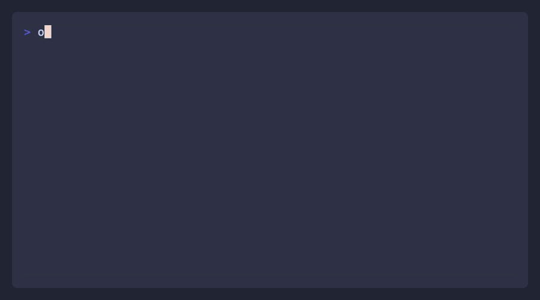

# Orthogonal CLI

CLI to access all APIs on the Orthogonal platform.



## Installation

```bash
# From npm (when published)
npm install -g orthogonal-cli

# Or use npx
npx orthogonal-cli <command>

# Local development
cd packages/cli
npm install
npm run build
node dist/index.js <command>
```

## Authentication

```bash
# Login with API key
orth login --key orth_live_your_key

# Or set environment variable
export ORTHOGONAL_API_KEY=orth_live_your_key

# Check auth status
orth whoami

# Logout
orth logout
```

## Commands

### Search for APIs

```bash
# Semantic search
orth search "email finder"
orth search "web scraping" --limit 20
```

### Browse APIs

```bash
# List all APIs
orth api

# Show API endpoints
orth api hunter

# Show endpoint details
orth api hunter /v2/domain-search
```

### Call APIs

```bash
# GET request with query params
orth run hunter /v2/domain-search -q domain=stripe.com

# POST request with body
orth run olostep /v1/scrapes --body '{"url": "https://stripe.com"}'

# Pipe JSON input
echo '{"url": "https://stripe.com"}' | orth run olostep /v1/scrapes

# Raw output for piping
orth run hunter /v2/domain-search -q domain=stripe.com --raw | jq '.emails'
```

### Generate Code

```bash
# TypeScript (default)
orth code hunter /v2/domain-search

# Python
orth code hunter /v2/domain-search --lang python

# cURL
orth code hunter /v2/domain-search --lang curl
```

### Account

```bash
# Check balance
orth balance

# View usage
orth usage --limit 20
```

## Examples

### Find emails for a company

```bash
orth run tomba /v1/domain-search -q domain=stripe.com -q limit=10
```

### Scrape a webpage

```bash
orth run olostep /v1/scrapes --body '{"url": "https://example.com", "formats": ["markdown"]}'
```

### Search the web

```bash
orth run andi /v1/search -q q="latest AI news"
```

## Development

```bash
# Install dependencies
npm install

# Build
npm run build

# Watch mode
npm run dev

# Test locally
node dist/index.js search "test"
```

## License

MIT
