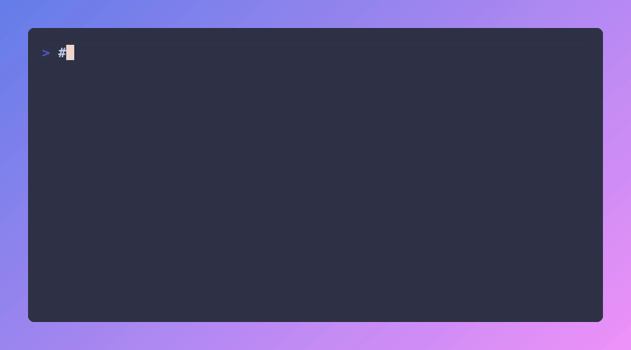
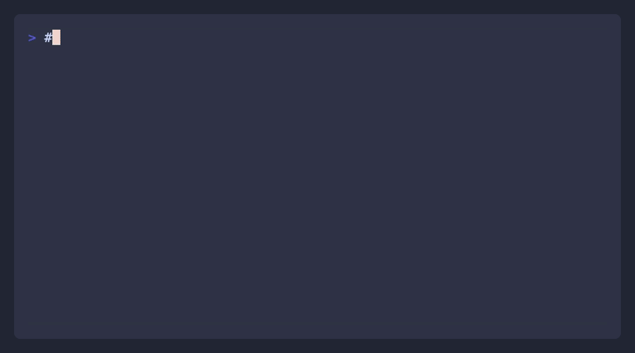
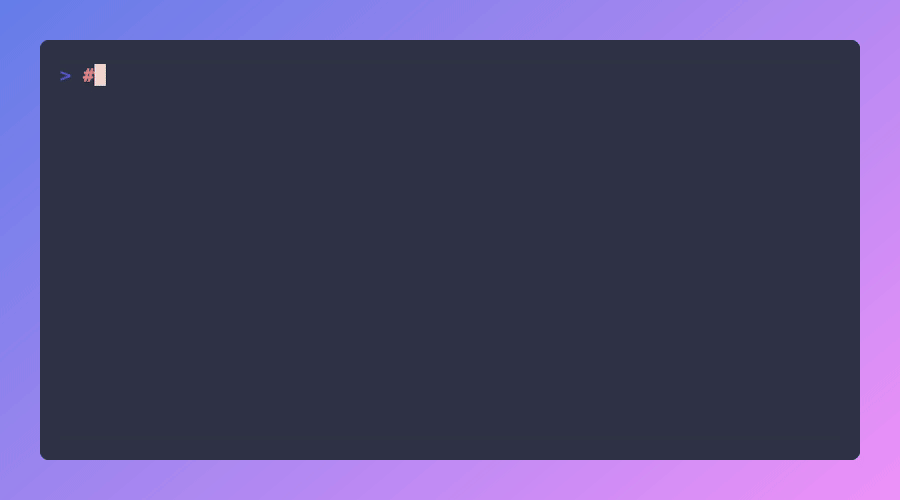

# Orthogonal CLI Demos

## Main Demo

Simple workflow: search → run

## Web Scraping with Olostep

Scrape any webpage to markdown

## Email Finder with Tomba

Find emails for a domain

## x402 Direct Payment

Get payment details for agent wallets

## Code Generation

Generate integration code in TypeScript, Python, or cURL
